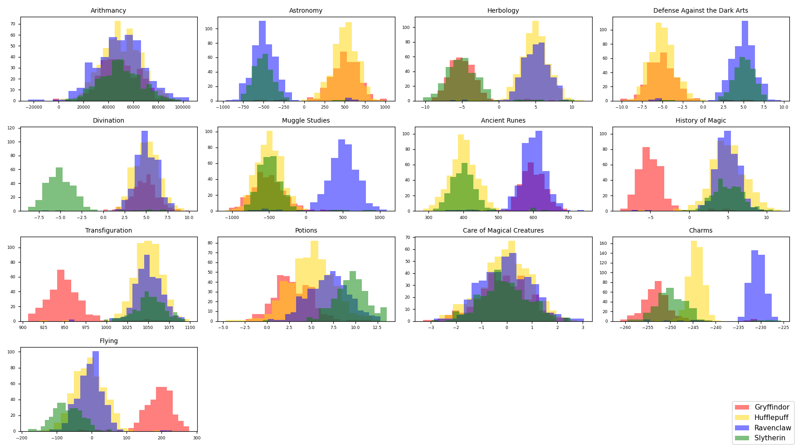
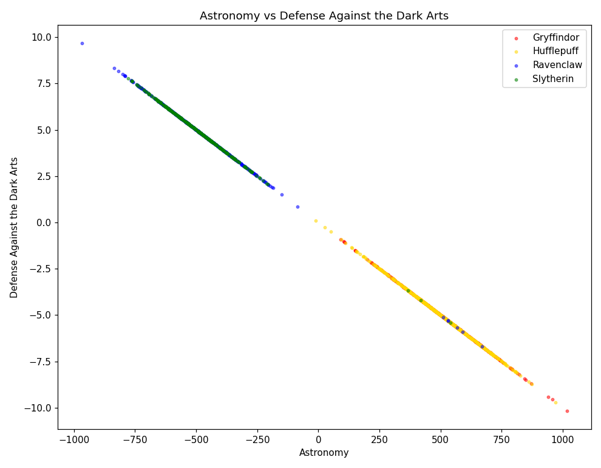
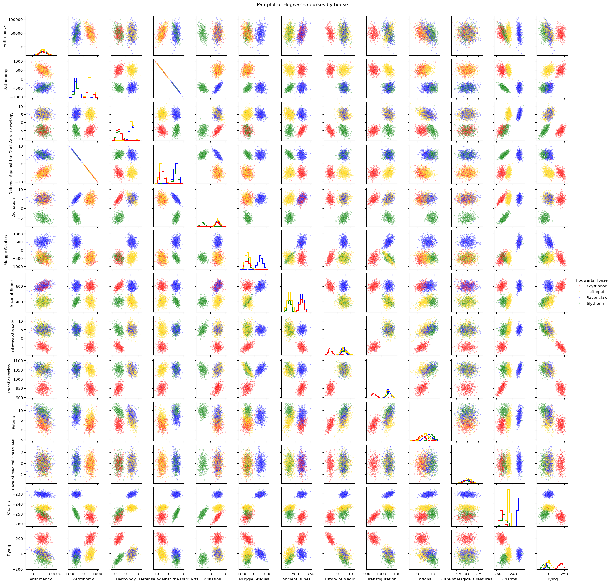

# DSLR — Harry Potter and the Data Scientist

A from-scratch **multiclass logistic regression** that re-sorts Hogwarts students
into their houses. The Sorting Hat is broken; given each student's scores in 13
magic courses, the classifier predicts one of four houses — Gryffindor,
Hufflepuff, Ravenclaw, or Slytherin — and reaches **~99.0% accuracy**.

The statistics and the model are implemented by hand (gradient descent, the
sigmoid, log-loss). No `describe()`, no ready-made classifier.

> A machine learning project from the **42 school** curriculum, evaluated by peer
> review. The classifier must reach at least 98% accuracy (measured with
> scikit-learn's `accuracy_score`) to be considered a worthy replacement for the
> Sorting Hat.

## Table of contents

- [Project layout](#project-layout)
- [Setup](#setup)
- [1. Data analysis](#1-data-analysis--describepy)
- [2. Data visualization](#2-data-visualization)
- [3. Logistic regression](#3-logistic-regression)
- [The math](#the-math)
- [Results](#results)

## Project layout

```
.
├── describe.py            # summary statistics, built from scratch
├── histogram.py           # per-house score distributions
├── scatter_plot.py        # the two most similar features
├── pair_plot.py           # scatter-plot matrix of all features
├── correlation_ranking.py # (bonus) ranks feature pairs by correlation
├── logreg_train.py        # trains one-vs-all logistic regression
├── logreg_predict.py      # writes houses.csv predictions
├── accuracy.py            # scores predictions against the ground truth
├── datasets/
│   ├── dataset_train.csv
│   ├── dataset_test.csv
│   └── dataset_truth.csv  # true houses for the test set
└── assets/                  # committed plots used in this README
```

## Setup

```bash
pip install pandas numpy matplotlib seaborn scikit-learn
```

`pandas`/`numpy` for data and math, `matplotlib`/`seaborn` for plots.
`scikit-learn` is only used to *measure* accuracy, never to build the model.

## 1. Data analysis — `describe.py`

Prints `Count, Mean, Std, Min, 25%, 50%, 75%, Max` for every numeric feature —
a hand-written reimplementation of `pandas.describe()`.

```bash
python describe.py datasets/dataset_train.csv
```

Each statistic is computed with explicit loops — no `mean`, `std`, `min`, `max`,
or `percentile` helpers. Three details are what make the output match pandas exactly.

**Missing values are skipped, not zero-filled.** The dataset has empty cells. Every
statistic ignores them, so `Count` is the number of values actually present in a
column (which is why it can be less than the number of rows). Treating a missing
value as `0` would quietly corrupt the mean, the std, and the percentiles all at once.

**Standard deviation divides by `N − 1`, not `N`.** This is the *sample* standard
deviation (Bessel's correction), which is what pandas uses:

```
std = sqrt( Σ(xᵢ − mean)² / (N − 1) )
```

Dividing by `N` instead would give a slightly smaller number that wouldn't line up
with the reference output.

**Percentiles use linear interpolation.** A percentile is a *position* in the sorted
data, and that position usually falls *between* two real data points — so we blend
the two neighbours instead of rounding to one. The steps:

1. Sort the values ascending.
2. Compute a fractional rank using 0-based indices: `rank = (p / 100) · (N − 1)`.
3. Let `lo = floor(rank)` and `frac = rank − lo` (how far past `lo` we are, 0–1).
4. Result = `sorted[lo] + frac · (sorted[lo+1] − sorted[lo])`.

For example, the median (`p = 50`) of `[10, 20, 30, 40, 50, 60]`:
`rank = 0.50 · (6 − 1) = 2.5`, so `lo = 2`, `frac = 0.5`, giving
`30 + 0.5 · (40 − 30) = 35` — exactly halfway between the two middle values, as
expected. When `rank` lands on a whole number, `frac = 0` and the value is read
directly. This is the same method numpy and pandas use by default.

## 2. Data visualization

### Histogram — which course is homogeneous?

```bash
python histogram.py datasets/dataset_train.csv
```



Each course's score distribution is drawn per house and overlaid.
**Care of Magical Creatures** (and **Arithmancy**) show all four houses stacked on
top of each other — a homogeneous distribution that carries no information for
telling houses apart. Compare that to **Flying** or **Defense Against the Dark
Arts**, where the houses sit in clearly separate places.

### Scatter plot — which two features are similar?

```bash
python scatter_plot.py datasets/dataset_train.csv
```



**Astronomy** and **Defense Against the Dark Arts** have a correlation of −1: every
point falls on a straight line, so the two features are redundant. We keep one and
drop the other.

A small helper ranks every pair by correlation, which is how the redundant pair was
found rather than guessed:

```bash
python correlation_ranking.py datasets/dataset_train.csv
```

### Pair plot — which features to keep?

```bash
python pair_plot.py datasets/dataset_train.csv
```



The scatter-plot matrix shows every feature against every other at once
(distributions on the diagonal). It ties the previous two views together and
drives feature selection.

**Features used for the model** (after dropping the homogeneous and redundant ones):

> Astronomy, Herbology, Divination, Muggle Studies, Ancient Runes,
> History of Magic, Transfiguration, Potions, Charms, Flying

## 3. Logistic regression

### Train

```bash
python logreg_train.py datasets/dataset_train.csv
```

This produces `weights.json`. The pipeline:

1. **Select** the 10 features above.
2. **Impute** missing values with each feature's training mean.
3. **Standardize** every feature to mean 0 / std 1 — essential for gradient descent
   to converge when features live on very different scales.
4. **Train** four binary classifiers (**one-vs-all**): "Gryffindor or not?",
   "Hufflepuff or not?", etc., each by gradient descent.
5. **Save** the four weight vectors *plus the training means and stds*, so prediction
   can reproduce the exact same transformation.

The cost is printed as it trains, so you can watch it converge:

```
[Gryffindor] epoch     0  cost = 0.425699
[Gryffindor] epoch   500  cost = 0.046218
[Gryffindor] epoch  2999  cost = 0.043595
```

### Predict

```bash
python logreg_predict.py datasets/dataset_test.csv weights.json
```

Loads the model, applies the **same** imputation and scaling using the saved
training statistics, runs all four classifiers, and assigns each student the house
whose classifier is most confident (`argmax`). Writes `houses.csv`:

```
Index,Hogwarts House
0,Hufflepuff
1,Ravenclaw
2,Gryffindor
...
```

## The math

Each binary classifier predicts a probability by passing a linear score through the
sigmoid:

```
hθ(x) = g(θᵀx),   g(z) = 1 / (1 + e^(−z))
```

Training minimizes the log-loss (convex for logistic regression, so gradient descent
reliably finds the global minimum):

```
J(θ) = −(1/m) Σ [ yⁱ·log(hθ(xⁱ)) + (1 − yⁱ)·log(1 − hθ(xⁱ)) ]
```

using the gradient

```
∂J/∂θⱼ = (1/m) Σ (hθ(xⁱ) − yⁱ)·xⱼⁱ
```

and the update rule `θ := θ − α·∂J/∂θ`, repeated for a fixed number of epochs.

For four houses, **one-vs-all** trains one such classifier per house and predicts the
house with the highest probability.

## Results

`accuracy.py` scores the predictions in `houses.csv` against the ground truth using
scikit-learn's `accuracy_score` — the same metric used at evaluation. (sklearn here
only *measures* the result; it is never part of the model.)

```bash
python accuracy.py houses.csv datasets/dataset_truth.csv
```

```
Correct: 396 / 400
Accuracy: 0.9900  (99.00%)
PASS (>= 98%)
```

**99.0% on the test set**, comfortably above the 98% target required for the
classifier to rival the Sorting Hat.
